# Диаграммы архитектуры ISS Tracker

## 1. Общая архитектура системы (C4 Level 1 - Context)

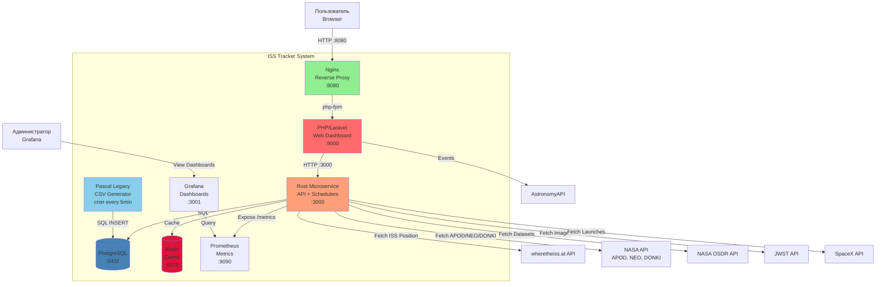

---

## 2. Архитектура Rust сервиса (C4 Level 2 - Containers)

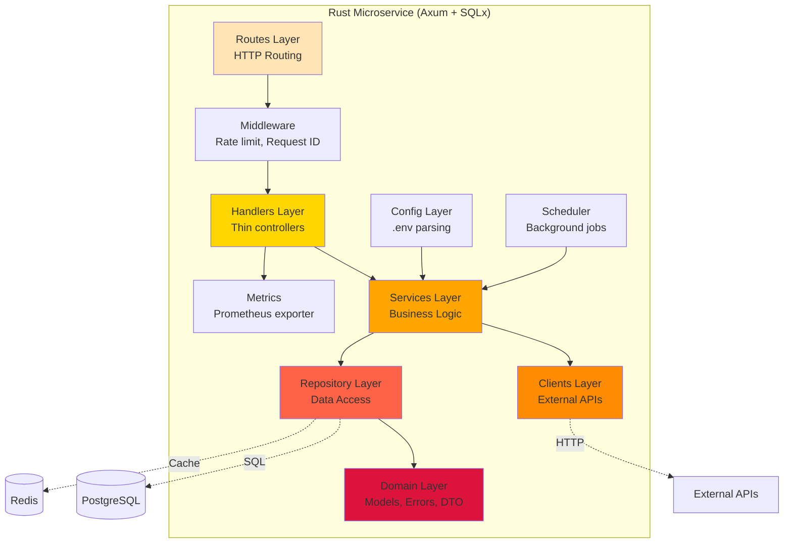

---

## 3. Слои Rust сервиса (детально)

### 3.1 Routes → Handlers → Services

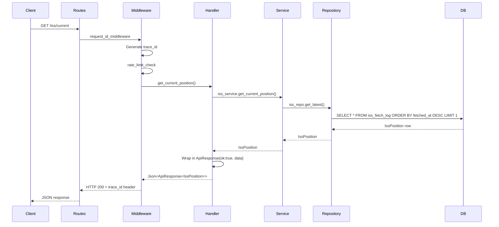

---

## 4. Фоновый планировщик (Scheduler)

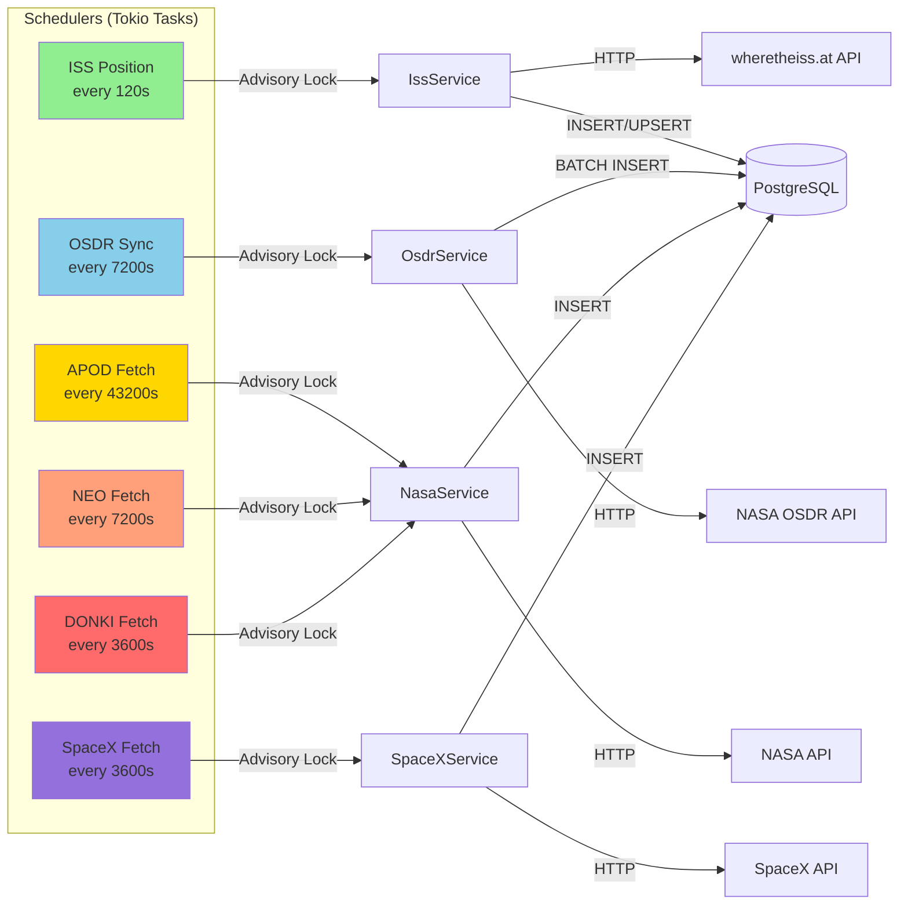

---

## 5. Единый формат ошибок

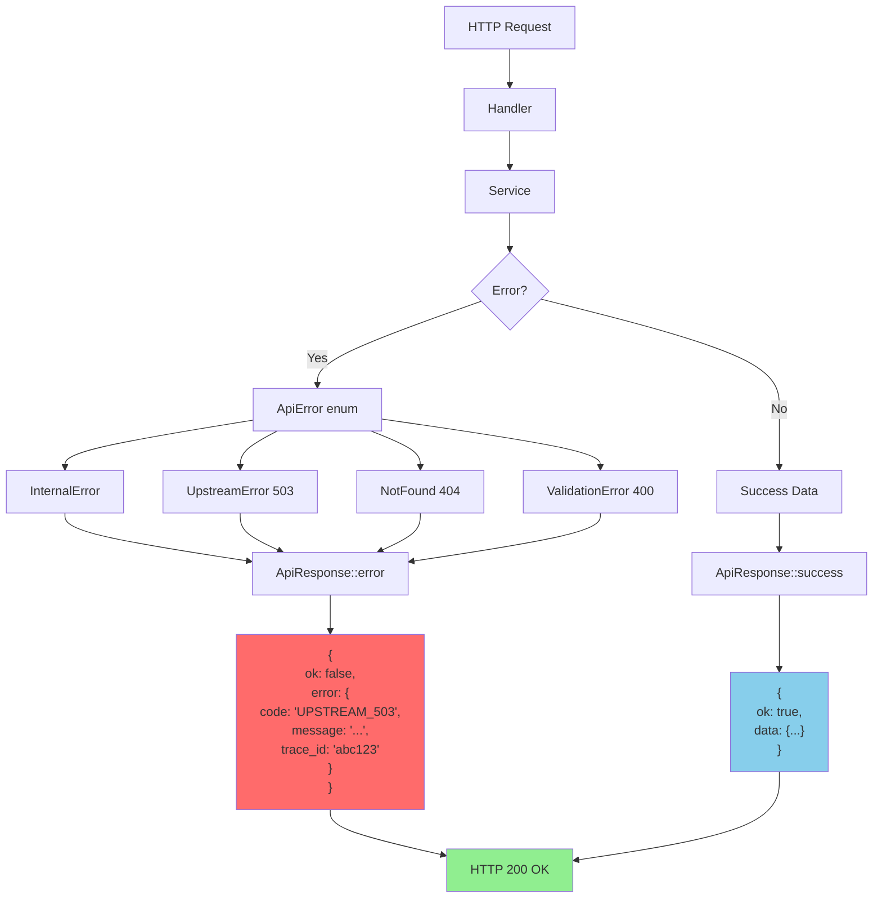

---

## 6. Laravel архитектура (Service + Repository)

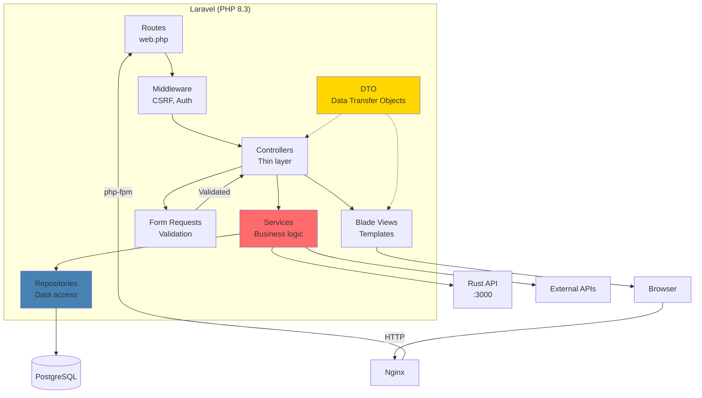

---

## 7. Производительность: Batch Processing (OSDR)

### До оптимизации (Single INSERT)
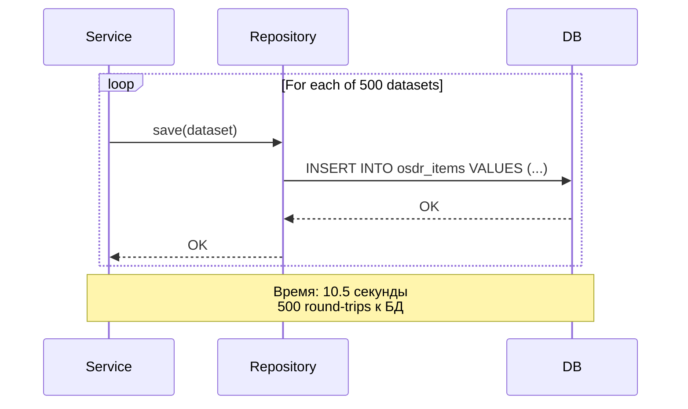

### После оптимизации (Batch UNNEST)
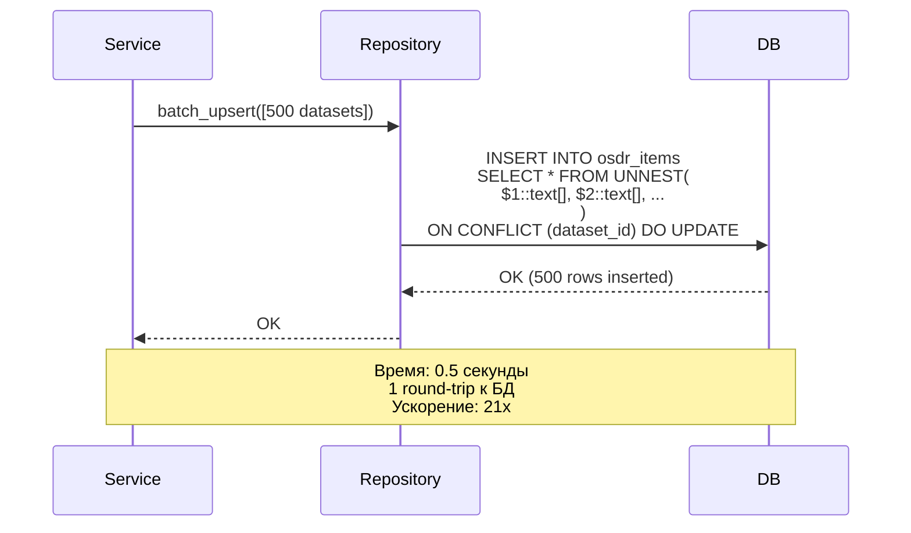

---

## 8. Кэширование (Redis)

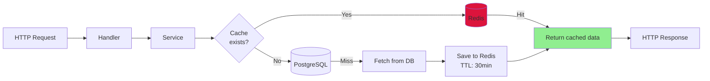

---

## 9. Мониторинг (Prometheus + Grafana)

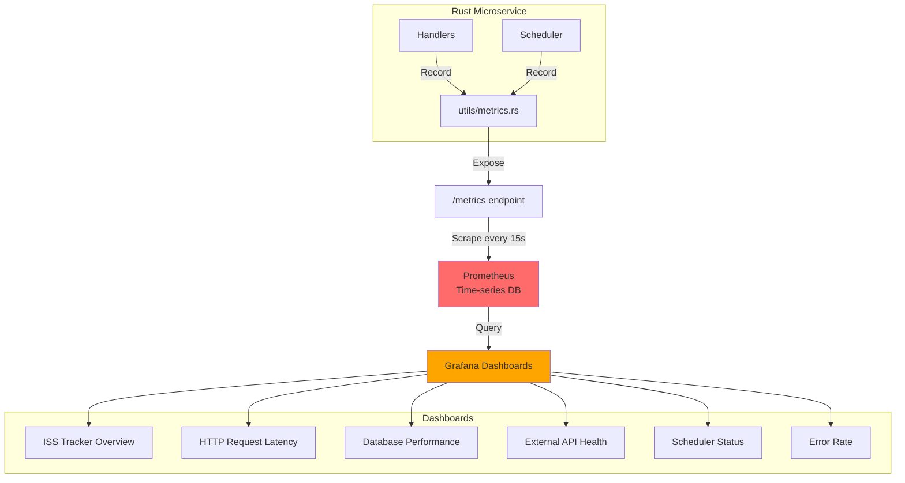

---

## 10. Защита от SQL Injection

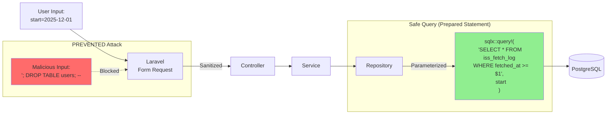

---

## 11. Deployment Flow (Docker Compose)

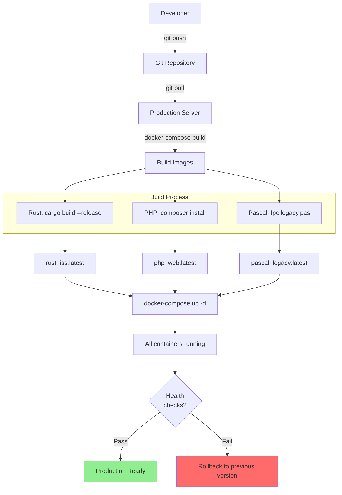

---

## 12. Data Flow: ISS Position Update

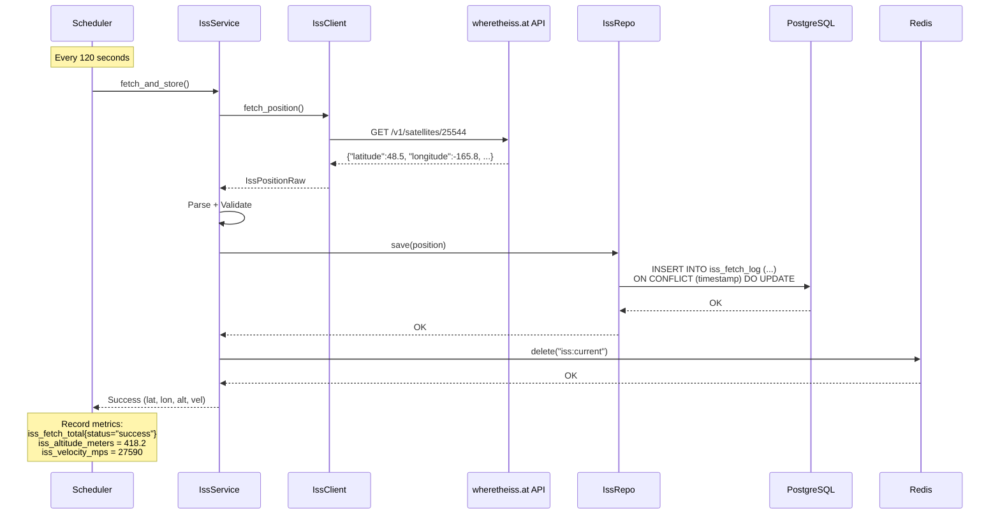

---

## 13. Pascal Legacy → Go Migration

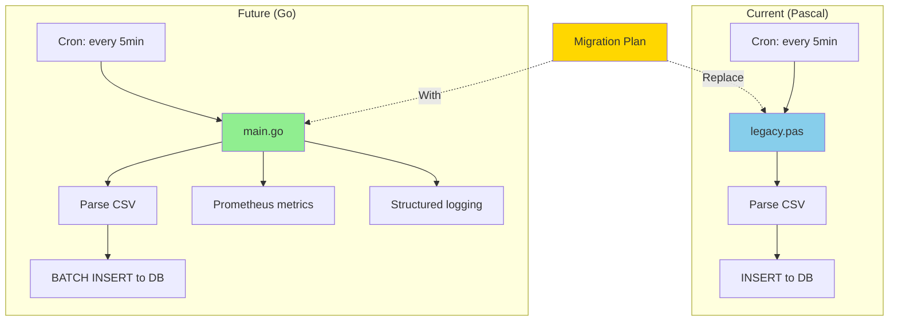

---

