# 📊 Диаграммы архитектуры ISS Tracker

## 1. 🌐 Общая архитектура системы (C4 Level 1 - Context)

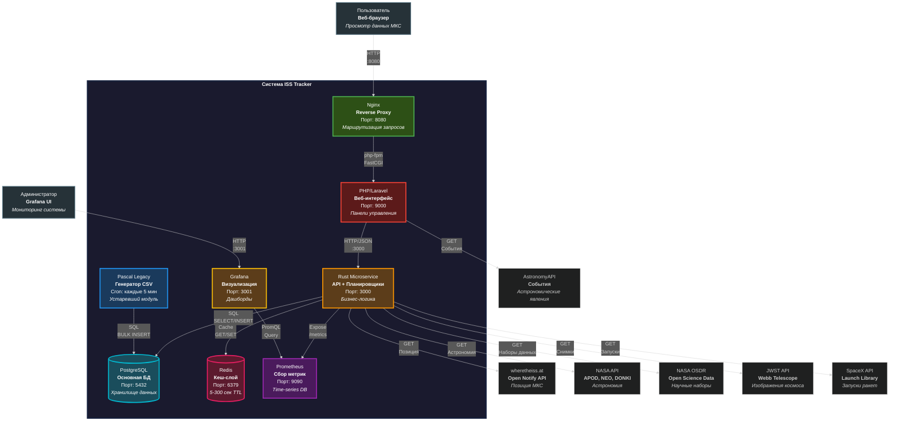

---

## 2.  Архитектура Rust микросервиса (7-слойная архитектура)

```mermaid
%%{init: {'theme':'dark', 'themeVariables': { 'fontSize':'15px'}, 'flowchart': {'nodeSpacing': 50, 'rankSpacing': 80}}}%%
graph TB
    subgraph RustService["<b> Rust Microservice (Actix-web + SQLx + Tokio)</b>"]
        direction TB
        
        subgraph Layer1["<b> Слой 1: Маршруты (Routes)</b>"]
            Routes[" routes/mod.rs<br/><i>Определение эндпоинтов</i><br/>/iss, /nasa, /osdr, /jwst"]
        end
        
        subgraph Layer2["<b> Слой 2: Обработчики (Handlers)</b>"]
            Handlers[" HTTP Controllers<br/><i>Тонкие обработчики</i><br/>iss_handler, nasa_handler"]
        end
        
        subgraph Layer3["<b⚙️ Слой 3: Бизнес-логика (Services)</b>"]
            Services[" Business Logic<br/><i>Основная логика</i><br/>iss_service, osdr_service"]
        end
        
        subgraph Layer4["<b> Слой 4: HTTP-клиенты (Clients)</b>"]
            Clients[" External API Clients<br/><i>Внешние запросы</i><br/>reqwest HTTP client"]
        end
        
        subgraph Layer5["<b> Слой 5: Репозитории (Repository)</b>"]
            Repo[" Data Access Layer<br/><i>Работа с БД</i><br/>SQLx queries + Redis"]
        end
        
        subgraph Layer6["<b> Слой 6: Доменная модель (Domain)</b>"]
            Domain[" Models, Errors, DTOs<br/><i>Типы данных</i><br/>IssPosition, ApiError"]
        end
        
        subgraph Layer7["<b> Слой 7: Конфигурация (Config)</b>"]
            Config[" Configuration<br/><i>Настройки из .env</i><br/>Database URLs, API keys"]
        end
        
        subgraph CrossCutting["<b> Кросс-функциональные компоненты</b>"]
            Middleware[" Middleware<br/><i>Rate limiting<br/>Request ID<br/>CORS</i>"]
            Scheduler[" Scheduler<br/><i>Фоновые задачи<br/>Tokio cron jobs</i>"]
            Metrics[" Metrics<br/><i>Prometheus<br/>exporter</i>"]
        end
    end
    
    Routes --> Middleware
    Middleware --> Handlers
    Handlers --> Services
    Services --> Clients
    Services --> Repo
    Repo --> Domain
    Config -.->|Инициализация| Services
    Scheduler -.->|Вызов| Services
    Handlers -.->|Экспорт| Metrics
    
    Clients -.->|"HTTP<br/>Внешние API"| ExtAPI[" External APIs<br/>wheretheiss.at<br/>NASA, SpaceX"]
    Repo -.->|"SQL<br/>Запросы"| PostgreSQL[(" PostgreSQL<br/>Партиции<br/>Индексы")]
    Repo -.->|"Cache<br/>GET/SET"| RedisDB[(" Redis<br/>5-300 сек<br/>TTL")]
    
    style RustService fill:#0d1117,stroke:#30363d,stroke-width:2px
    
    style Layer1 fill:#1a472a,stroke:#4CAF50,stroke-width:3px,color:#fff
    style Layer2 fill:#1a3a5c,stroke:#2196F3,stroke-width:3px,color:#fff
    style Layer3 fill:#5c3d1a,stroke:#FF9800,stroke-width:3px,color:#fff
    style Layer4 fill:#4a1a5c,stroke:#9C27B0,stroke-width:3px,color:#fff
    style Layer5 fill:#5c1a1a,stroke:#F44336,stroke-width:3px,color:#fff
    style Layer6 fill:#3d2f1a,stroke:#795548,stroke-width:3px,color:#fff
    style Layer7 fill:#2d3a42,stroke:#607D8B,stroke-width:3px,color:#fff
    style CrossCutting fill:#1a2332,stroke:#455A64,stroke-width:3px,color:#fff
    
    style Routes fill:#4CAF50,stroke:#81C784,stroke-width:2px,color:#000
    style Handlers fill:#2196F3,stroke:#64B5F6,stroke-width:2px,color:#fff
    style Services fill:#FF9800,stroke:#FFB74D,stroke-width:2px,color:#000
    style Clients fill:#9C27B0,stroke:#BA68C8,stroke-width:2px,color:#fff
    style Repo fill:#F44336,stroke:#E57373,stroke-width:2px,color:#fff
    style Domain fill:#795548,stroke:#A1887F,stroke-width:2px,color:#fff
    style Config fill:#607D8B,stroke:#90A4AE,stroke-width:2px,color:#fff
```

---

## 3. 🔄 Поток обработки запроса (Sequence Diagram)

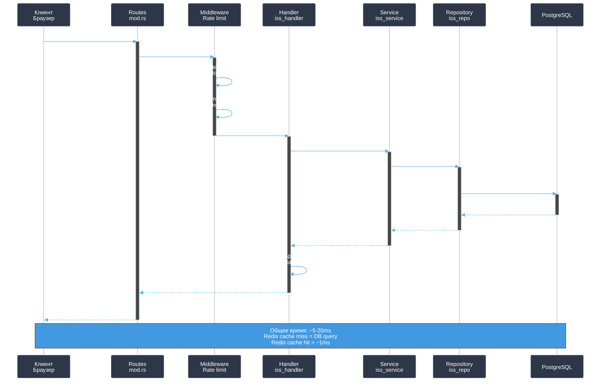

---

## 4.  Фоновый планировщик (Scheduler Architecture)

```mermaid
%%{init: {'theme':'dark', 'themeVariables': { 'fontSize':'15px'}, 'flowchart': {'nodeSpacing': 60, 'rankSpacing': 100}}}%%
graph TB
    subgraph Schedulers["<b> Планировщики задач (Tokio Async Tasks)</b>"]
        direction TB
        ISS[" ISS Position<br/><b>Каждые 120 сек</b><br/><i>Отслеживание позиции МКС</i>"]
        OSDR[" OSDR Sync<br/><b>Каждые 7200 сек (2ч)</b><br/><i>Синхронизация наборов</i>"]
        APOD[" APOD Fetch<br/><b>Каждые 43200 сек (12ч)</b><br/><i>Фото дня от NASA</i>"]
        NEO[" NEO Fetch<br/><b>Каждые 7200 сек (2ч)</b><br/><i>Астероиды рядом с Землёй</i>"]
        DONKI[" DONKI Fetch<br/><b>Каждые 3600 сек (1ч)</b><br/><i>События космической погоды</i>"]
        SpaceX[" SpaceX Fetch<br/><b>Каждые 3600 сек (1ч)</b><br/><i>Ближайшие запуски</i>"]
    end
    
    subgraph Services["<b> Сервисный слой</b>"]
        direction TB
        IssService["IssService<br/><i>Логика МКС</i>"]
        OsdrService["OsdrService<br/><i>Логика OSDR</i>"]
        NasaService["NasaService<br/><i>Логика NASA</i>"]
        SpaceXService["SpaceXService<br/><i>Логика SpaceX</i>"]
    end
    
    subgraph ExternalAPIs["<b> Внешние API</b>"]
        direction TB
        WhereISS["wheretheiss.at API<br/><i>Real-time ISS location</i>"]
        OSDRAPI["NASA OSDR API<br/><i>Science datasets</i>"]
        NASAAPI["NASA API<br/><i>APOD, NEO, DONKI</i>"]
        SpaceXAPI["SpaceX API<br/><i>Launch schedule</i>"]
    end
    
    DB[(" PostgreSQL<br/><b>Основная БД</b><br/><i>Партиции по времени</i>")]
    
    ISS -->|" Advisory Lock<br/>pg_try_advisory_lock"| IssService
    OSDR -->|" Advisory Lock"| OsdrService
    APOD -->|" Advisory Lock"| NasaService
    NEO -->|" Advisory Lock"| NasaService
    DONKI -->|" Advisory Lock"| NasaService
---

## 5.  Единый формат обработки ошибок

```mermaid
%%{init: {'theme':'dark', 'themeVariables': { 'fontSize':'15px'}, 'flowchart': {'nodeSpacing': 50, 'rankSpacing': 80}}}%%
graph TD
    Request[" HTTP Request<br/><i>Входящий запрос</i>"] --> Handler["🎯 Handler<br/><i>Обработчик</i>"]
    Handler --> Service[" Service<br/><i>Бизнес-логика</i>"]
    Service --> Error{" Error?<br/><i>Ошибка возникла?</i>"}
    
    Error -->|" Нет"| Success[" Success Data<br/><i>Успешные данные</i>"]
    Error -->|" Да"| ApiError[" ApiError enum<br/><i>Тип ошибки</i>"]
    
    ApiError --> InternalError[" InternalError<br/><b>500</b><br/><i>Внутренняя ошибка</i><br/>DB failure, Panic"]
    ApiError --> UpstreamError[" UpstreamError<br/><b>503</b><br/><i>Внешний API недоступен</i><br/>NASA API timeout"]
    ApiError --> NotFound[" NotFound<br/><b>404</b><br/><i>Ресурс не найден</i><br/>Dataset not exists"]
    ApiError --> ValidationError["✓ ValidationError<br/><b>400</b><br/><i>Неверные данные</i><br/>Invalid date format"]
    
    InternalError --> Format[" ApiResponse::error()<br/><i>Унифицированный формат</i>"]
    UpstreamError --> Format
    NotFound --> Format
    ValidationError --> Format
    
    Success --> SuccessFormat[" ApiResponse::success()<br/><i>Формат успеха</i>"]
    
    Format --> ErrorResponse[" Error Response<br/><b>HTTP 200</b><br/><code>{<br/>  ok: false,<br/>  error: {<br/>    code: 'UPSTREAM_503',<br/>    message: 'NASA API unavailable',<br/>    trace_id: 'abc123-def456'<br/>  }<br/>}</code>"]
    
    SuccessFormat --> SuccessResponse[" Success Response<br/><b>HTTP 200</b><br/><code>{<br/>  ok: true,<br/>  data: {<br/>    latitude: 45.2,<br/>    longitude: -122.3<br/>  }<br/>}</code>"]
    
    ErrorResponse --> Client[" Client<br/><i>Клиент получает ответ</i>"]
    SuccessResponse --> Client
    
    style Request fill:#1a3a5c,stroke:#2196F3,stroke-width:2px,color:#fff
    style Handler fill:#2196F3,stroke:#64B5F6,stroke-width:2px,color:#fff
    style Service fill:#FF9800,stroke:#FFB74D,stroke-width:2px,color:#000
    style Error fill:#5c4d1a,stroke:#FFC107,stroke-width:3px,color:#000
    style ApiError fill:#5c1a1a,stroke:#F44336,stroke-width:3px,color:#fff
    
    style InternalError fill:#5c1a1a,stroke:#F44336,stroke-width:2px,color:#fff
    style UpstreamError fill:#5c3d1a,stroke:#FF5722,stroke-width:2px,color:#fff
    style NotFound fill:#5c4d1a,stroke:#FF9800,stroke-width:2px,color:#000
    style ValidationError fill:#5c5c1a,stroke:#FFC107,stroke-width:2px,color:#000
    
    style Format fill:#3d2f1a,stroke:#795548,stroke-width:2px,color:#fff
    style SuccessFormat fill:#2d5016,stroke:#4CAF50,stroke-width:2px,color:#fff
    
    style ErrorResponse fill:#5c1a1a,stroke:#F44336,stroke-width:3px,color:#fff
    style SuccessResponse fill:#2d5016,stroke:#4CAF50,stroke-width:3px,color:#fff
    style Success fill:#2d5016,stroke:#4CAF50,stroke-width:2px,color:#fff
    
    style Client fill:#2d3a42,stroke:#607D8B,stroke-width:2px,color:#fff

---

## 5. Единый формат ошибок

```mermaid
graph TD
    Request[HTTP Request] --> Handler
    Handler --> Service
    Service --> Error{Error?}
    
    Error -->|Yes| ApiError[ApiError enum]
    Error -->|No| Success[Success Data]
    
    ApiError --> InternalError[InternalError]
    ApiError --> UpstreamError[UpstreamError 503]
    ApiError --> NotFound[NotFound 404]
    ApiError --> ValidationError[ValidationError 400]
    
    InternalError --> Format[ApiResponse::error]
    UpstreamError --> Format
    NotFound --> Format
    ValidationError --> Format
    Success --> SuccessFormat[ApiResponse::success]
    
    Format --> Response["{<br/>  ok: false,<br/>  error: {<br/>    code: 'UPSTREAM_503',<br/>    message: '...',<br/>    trace_id: 'abc123'<br/>  }<br/>}"]
    
    SuccessFormat --> ResponseOK["{<br/>  ok: true,<br/>  data: {...}<br/>}"]
    
    Response --> HTTP200[HTTP 200 OK]
    ResponseOK --> HTTP200
    
    style HTTP200 fill:#90EE90
    style Response fill:#FF6B6B
    style ResponseOK fill:#87CEEB
```

---

## 6. 🐘 Архитектура Laravel (Service + Repository Pattern)

```mermaid
%%{init: {'theme':'dark', 'themeVariables': { 'fontSize':'15px'}, 'flowchart': {'nodeSpacing': 50, 'rankSpacing': 80}}}%%
graph TB
    Browser[" Браузер<br/><i>HTTP запросы</i>"]
    Nginx[" Nginx<br/><i>:8080</i>"]
    
    subgraph LaravelApp["<b>🐘 Laravel Application (PHP 8.3)</b>"]
        direction TB
        
        subgraph PresentationLayer["<b> Слой представления</b>"]
            Routes[" Routes<br/><i>web.php</i><br/>/dashboard, /iss, /osdr"]
            Middleware[" Middleware<br/><i>CSRF, Session, Auth</i>"]
            Controllers[" Controllers<br/><i>Тонкий слой</i><br/>DashboardController"]
            Views[" Blade Views<br/><i>Шаблоны UI</i><br/>dashboard.blade.php"]
        end
        
        subgraph BusinessLayer["<b> Слой бизнес-логики</b>"]
            Services[" Services<br/><i>Основная логика</i><br/>IssService, OsdrService"]
            Requests[" Form Requests<br/><i>Валидация данных</i><br/>StoreRequest"]
        end
        
        subgraph DataLayer["<b> Слой данных</b>"]
            Repositories[" Repositories<br/><i>Доступ к БД</i><br/>IssRepository"]
            DTO[" DTO<br/><i>Объекты передачи</i><br/>IssPositionDTO"]
        end
    end
    
    DB[(" PostgreSQL<br/><b>Основная БД</b><br/><i>SQLx queries</i>")]
    RustAPI[" Rust API<br/><b>:3000</b><br/><i>/iss/last, /osdr/datasets</i>"]
    ExtAPI[" External APIs<br/><b>AstronomyAPI</b><br/><i>Астрономические события</i>"]
    
    Browser -->|"HTTP<br/>Request"| Nginx
    Nginx -->|"php-fpm<br/>FastCGI"| Routes
    Routes --> Middleware
    Middleware --> Controllers
    Controllers --> Requests
    Requests -->|" Валидировано"| Controllers
    Controllers --> Services
    Controllers --> Views
    
    Services --> Repositories
    Services -->|"HTTP/JSON"| RustAPI
    Services -->|"HTTP/JSON"| ExtAPI
    Repositories -->|"SQL<br/>SELECT/INSERT"| DB
    
    DTO -.->|"Передача<br/>данных"| Controllers
    DTO -.->|"Передача<br/>данных"| Views
    
    Views -->|"HTML<br/>Response"| Browser
    
    style LaravelApp fill:#0d1117,stroke:#30363d,stroke-width:2px
    style PresentationLayer fill:#1a3a5c,stroke:#2196F3,stroke-width:3px,color:#fff
    style BusinessLayer fill:#5c3d1a,stroke:#FF9800,stroke-width:3px,color:#fff
    style DataLayer fill:#5c1a1a,stroke:#F44336,stroke-width:3px,color:#fff
    
    style Routes fill:#2196F3,stroke:#64B5F6,stroke-width:2px,color:#fff
    style Middleware fill:#607D8B,stroke:#90A4AE,stroke-width:2px,color:#fff
    style Controllers fill:#2196F3,stroke:#64B5F6,stroke-width:2px,color:#fff
    style Views fill:#9C27B0,stroke:#BA68C8,stroke-width:2px,color:#fff
    
    style Services fill:#FF9800,stroke:#FFB74D,stroke-width:2px,color:#000
    style Requests fill:#FFC107,stroke:#FFD54F,stroke-width:2px,color:#000
    
    style Repositories fill:#F44336,stroke:#E57373,stroke-width:2px,color:#fff
    style DTO fill:#FFC107,stroke:#FFD54F,stroke-width:2px,color:#000
    
    style DB fill:#1a4d5c,stroke:#00BCD4,stroke-width:3px,color:#fff
    style RustAPI fill:#5c3d1a,stroke:#FF9800,stroke-width:3px,color:#fff
    style ExtAPI fill:#4a1a5c,stroke:#9C27B0,stroke-width:3px,color:#fff
```

---

## 7. Производительность: Batch Processing (OSDR)

### До оптимизации (Single INSERT)
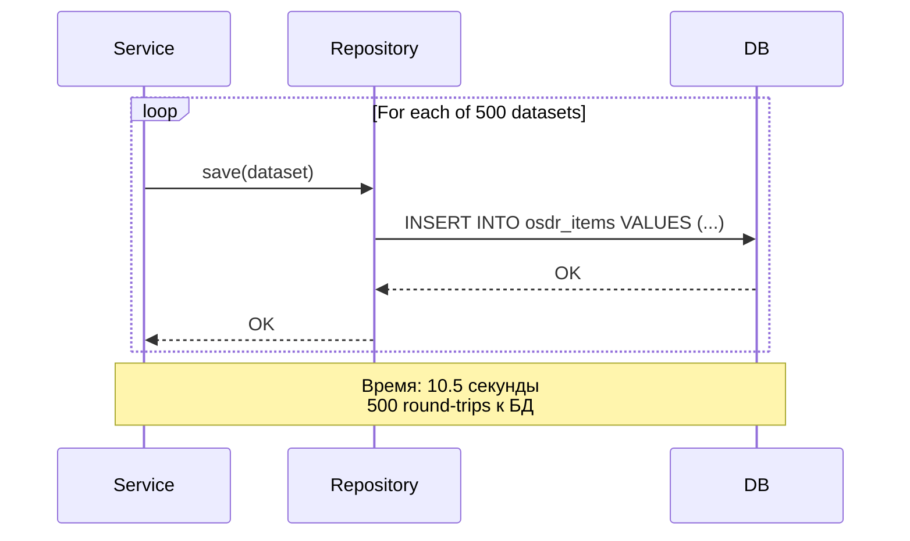

### После оптимизации (Batch UNNEST)
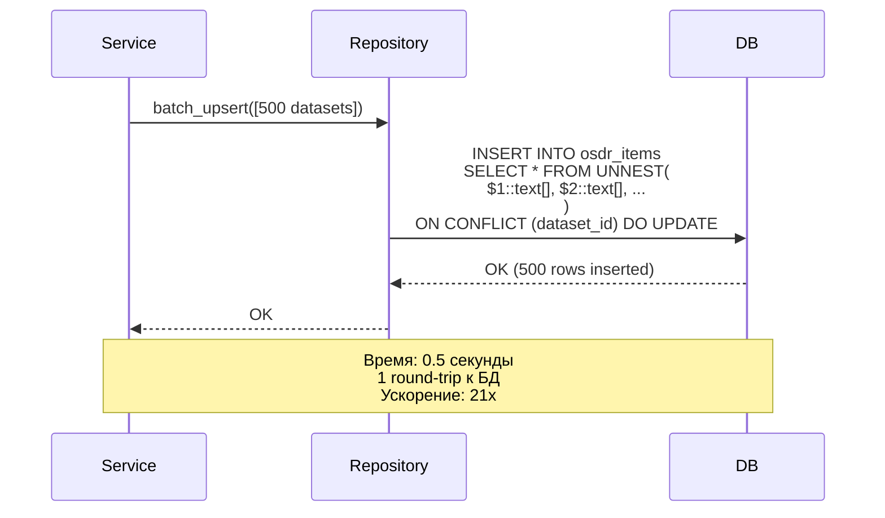

---

## 8. Кэширование (Redis)

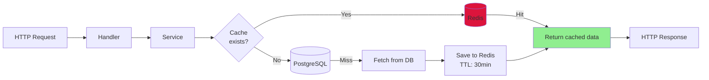

---

## 9. Мониторинг (Prometheus + Grafana)

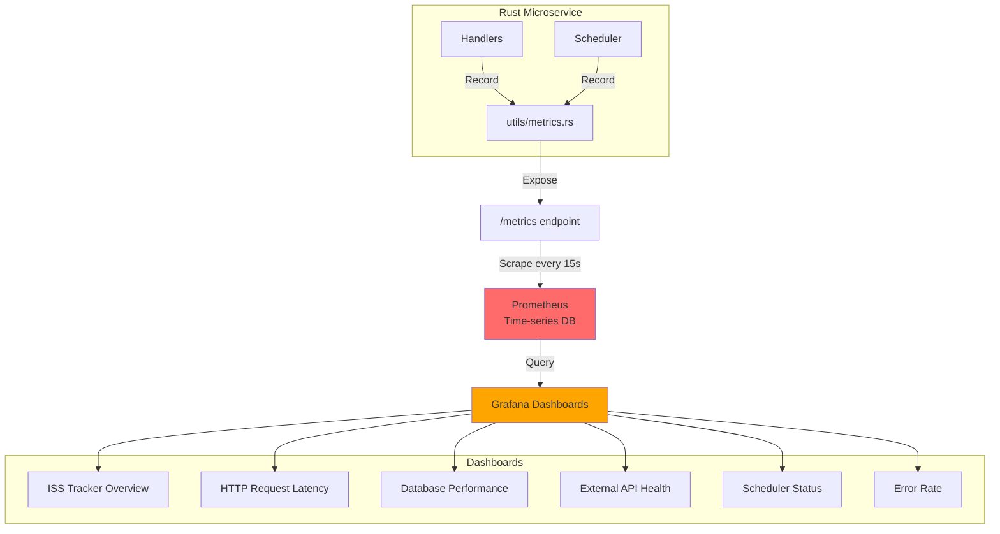

---

## 10. Защита от SQL Injection

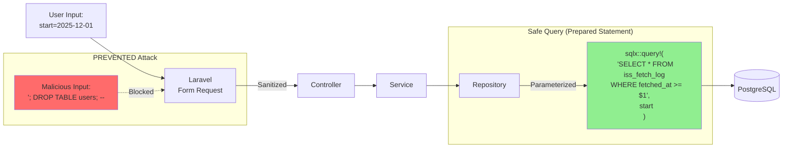

---

## 11. Deployment Flow (Docker Compose)

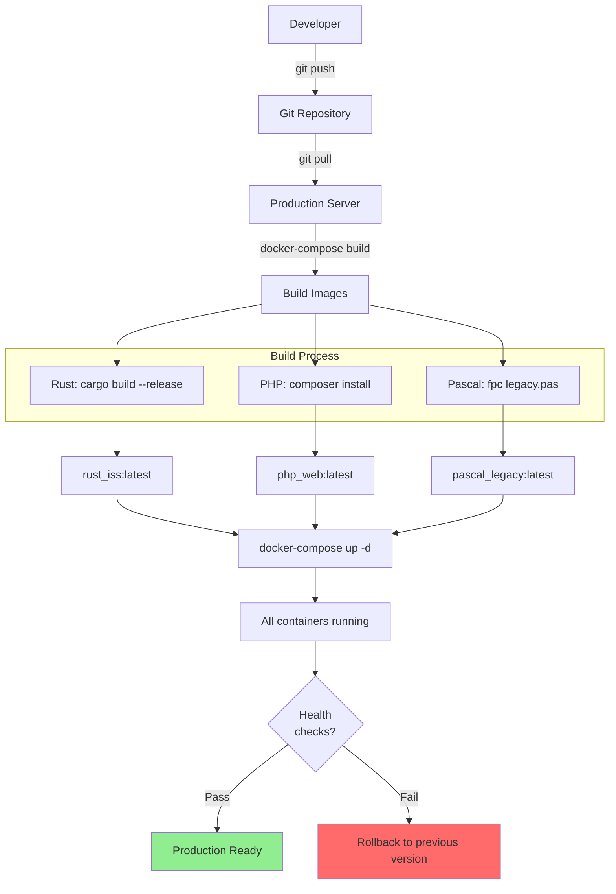

---

## 12. Data Flow: ISS Position Update

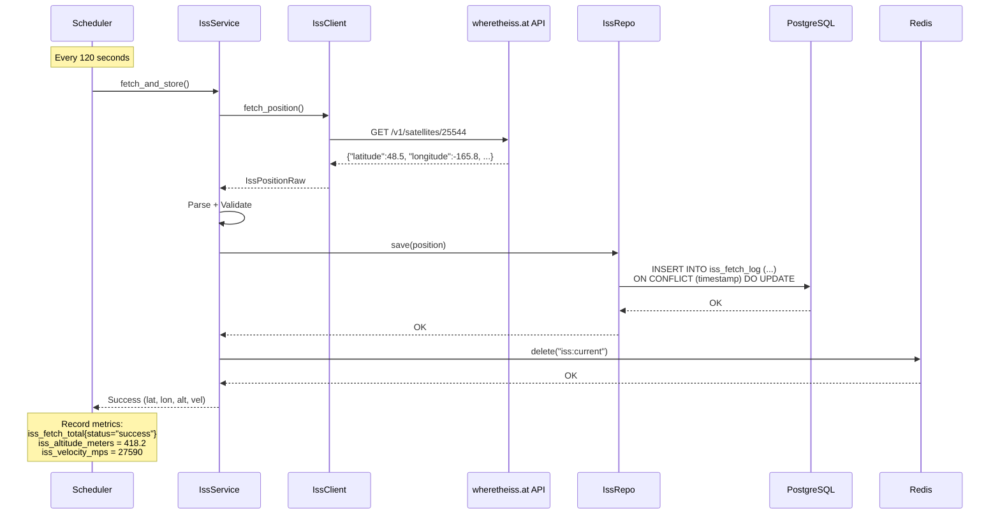

---

## 13. Pascal Legacy → Go Migration

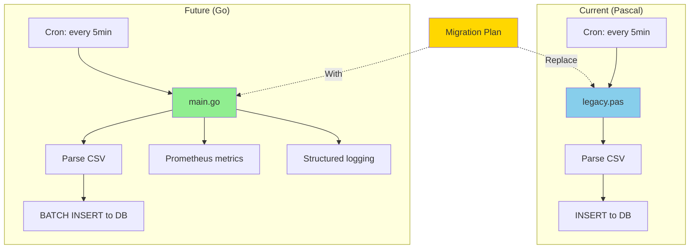

---


